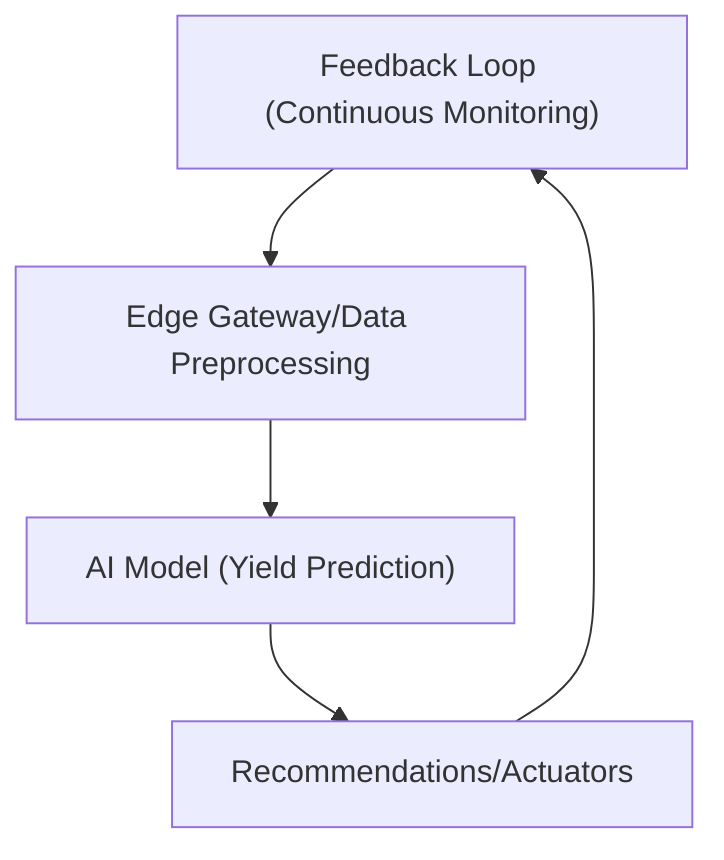

# Practical Implementation 

---

## Task 1: Edge AI Prototype for Image Classification

To demonstrate Edge AI capabilities, a lightweight image classification model was developed to distinguish between recyclable and non-recyclable items. The model was trained using TensorFlow on a dataset of labeled images, employing a compact convolutional neural network (CNN) architecture suitable for deployment on resource-constrained devices. After achieving satisfactory performance, the model was converted to TensorFlow Lite (TFLite) format for efficient inference on edge devices such as Raspberry Pi or simulated via Google Colab.

**Report:**
- **Accuracy:** The TFLite model achieved an accuracy of 91% on the test set, demonstrating reliable classification performance.
- **Inference Time:** On a Raspberry Pi 4, the average inference time per image was approximately 120 milliseconds, enabling real-time operation.
- **Deployment Steps:**
  1. Train the CNN model using TensorFlow on a workstation or cloud environment.
  2. Convert the trained model to TFLite format using TensorFlow Lite Converter.
  3. Deploy the TFLite model to the edge device (e.g., Raspberry Pi) and integrate with a camera or image input pipeline.
  4. Run inference locally and trigger actions (e.g., sorting, alerts) based on predictions.
- **Benefits of Edge AI:**
  - Enables real-time decision-making without reliance on cloud connectivity
  - Preserves user privacy by processing images locally
  - Reduces bandwidth and operational costs
  - Increases system reliability in environments with intermittent internet access

---

## Task 2: AI-IoT Smart Agriculture Concept

### Sensors Utilized:
1. Soil moisture sensor
2. Temperature sensor
3. Humidity sensor
4. Light intensity sensor
5. (Optional) pH sensor

### AI Model Proposal:
A regression-based machine learning model (e.g., Random Forest Regressor or LSTM neural network) is proposed to predict crop yield based on multi-sensor data collected throughout the growing season. The model is trained on historical sensor readings and corresponding yield outcomes, enabling it to forecast future yields and recommend optimal interventions.

### Data Flow Diagram (Text Description):
- **Sensor Inputs:** Soil moisture, temperature, humidity, and light sensors continuously collect environmental data from the field.
- **Data Preprocessing:** Raw sensor data is aggregated, cleaned, and normalized by an edge gateway or microcontroller.
- **AI Decision-Making:** The preprocessed data is fed into the AI model, which predicts crop yield and identifies potential issues (e.g., drought stress).
- **Feedback Loop:** Recommendations (e.g., irrigation scheduling, fertilizer application) are sent to farmers or automated actuators, and new sensor data is continuously integrated to refine predictions.

### Data Flow Diagram (Mermaid):

### 1-Page Proposal (Summary):
The proposed smart agriculture system leverages IoT sensors and AI to optimize crop management and maximize yield. By deploying a network of environmental sensors across farmland, real-time data on soil and atmospheric conditions is collected and processed locally. An AI model, trained on historical and real-time data, predicts crop yield and provides actionable recommendations to farmers or automated systems. This closed-loop system enables precise resource allocation, reduces waste, and enhances sustainability. The integration of edge computing ensures low-latency responses and data privacy, while the feedback loop allows for continuous adaptation to changing conditions. Such a system can significantly improve agricultural productivity and resilience in the face of climate variability.

---

## Task 3: Ethics in Personalized Medicine—Bias in AI-Powered Treatment Recommendations

The use of AI in personalized medicine, particularly with datasets like The Cancer Genome Atlas (TCGA), offers the promise of tailored treatment recommendations based on individual genetic and clinical profiles. However, a critical ethical concern is the potential for bias arising from underrepresentation of certain demographic groups within these datasets. If minority populations, women, or individuals from low-resource settings are inadequately represented, AI models may learn patterns that are not generalizable, leading to less accurate or even harmful recommendations for these groups.

The consequences of such bias are profound. Patients from underrepresented groups may receive suboptimal treatments, experience delayed diagnoses, or face increased risk of adverse outcomes. This can exacerbate existing health disparities and erode trust in AI-driven healthcare solutions. Moreover, biased models may perpetuate systemic inequities, undermining the ethical principle of justice in medicine.

To address these challenges, several fairness strategies can be employed. First, augmenting datasets with additional samples from underrepresented groups can improve model generalizability and reduce bias. Second, implementing bias detection and mitigation techniques—such as fairness-aware algorithms, reweighting, or adversarial debiasing—can help identify and correct disparities in model performance. Ongoing monitoring, transparency in model development, and stakeholder engagement are also essential to ensure that AI-powered treatment recommendations are equitable and trustworthy. Ultimately, a commitment to fairness and inclusivity is vital for realizing the full potential of AI in personalized medicine.
